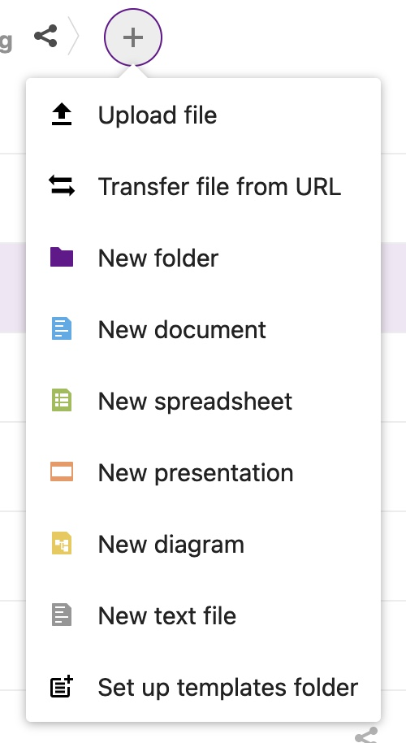
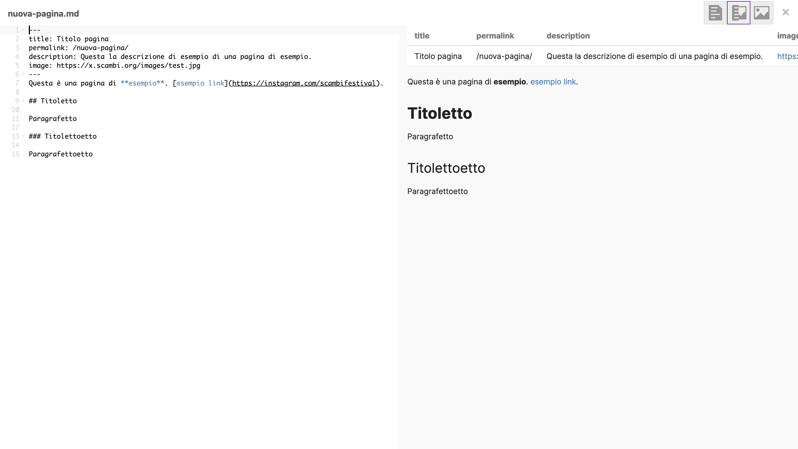
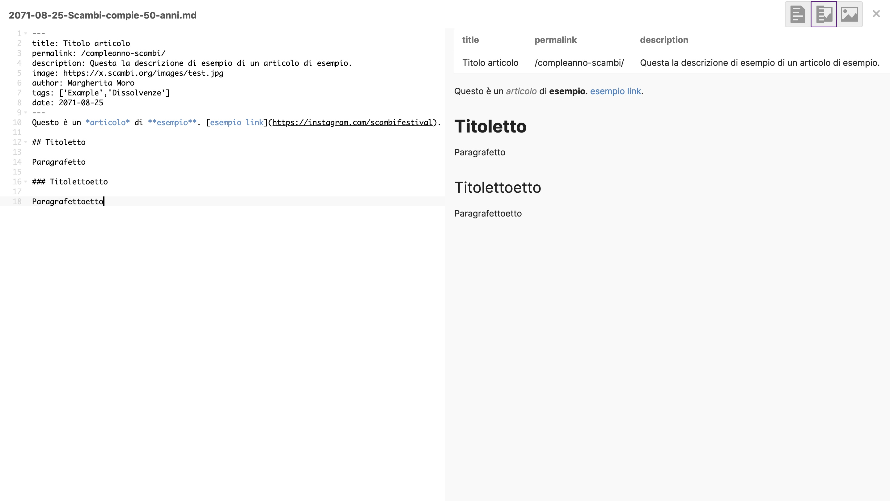

# ⚛ scambi.org

Il sito web di Scambi ([scambi.org](https://scambi.org)) è generato grazie ad uno [_Static Site Generator_](https://www.cloudflare.com/learning/performance/static-site-generator/) chiamato [Eleventy](https://11ty.dev). Semplificando al massimo, funziona così: si mettono in una cartella (_repository_), una serie di file di testo contenenti dati o pagine, che Eleventy legge e sputa fuori le pagine del sito pronto.

### Nuova pagina

1. Su [Nuvola](nuvola/), aprire [la cartella “scambi.org”](https://nuvola.scambi.org/f/215914). All’interno di questa cartella di trovano tutti i file che compongono tutte le pagine del sito: occorre **addentrarvisi con estrema cautela**.
2. Aprire la cartella dove ha più senso mettere la nuova pagina: se si tratta di una pagina relativa ad un’edizione, posizionarsi dentro la cartella di quell’anno (e.g. la [cartella `2022`](https://nuvola.scambi.org/f/218703)), se si tratta di una pagina in inglese, aprire la [cartella `en`](https://nuvola.scambi.org/f/215920), se si tratta di un articolo, recarsi nella cartella `blog` (e seguire [la guida di seguito](scambi.org.md#undefined)).
3. Una volta nella cartella giusta, in alto, cliccare sul pulsante “+” e selezionare “**New text file**” (o, in italiano, “Nuovo file di testo”): 
4. Si aprirà una pagina come quella dell’immagine di seguito. Sulla destra, si può vedere l’anteprima del testo formattato, mentre sulla sinistra si potrà scrivere il testo della pagina, con [sintassi Markdown](markdown.md). Se non intendete rendere più semplice il lavoro del gruppo Silicon/Paguri e <mark style="background-color:yellow;">se non avete voglia di imparare alcune semplici ulteriori cosine, passate direttamente al</mark> <mark style="background-color:yellow;"></mark><mark style="background-color:yellow;">**punto 6**</mark>.
5. Dopo avere scritto la pagina, inserire in cima due righe con tre trattini (`---`), come si vede a sinistra nello screenshot. In mezzo, saranno da scrivere alcune informazioni sulla pagina, chiamate **metadati**. Questo pezzetto incluso fra le righette si chiama **front matter**. Sono obbligatori solo i metadati in grassetto.
   * **`title`**: il titolo della pagina.
   * `permalink`: la stringa che segue l’indirizzo `scambi.org`. Scrivendo `/nuova-pagina/`, il link della pagina sarà `scambi.org/nuova-pagina`. **Nota**: <mark style="background-color:blue;">mettere sempre uno slash iniziale ed uno finale</mark>.
   * `description`: una breve descrizione dei contenuti della pagina, che apparirà nell’anteprima (quella cosa che appare sopra il messaggio quando si invia un link via WhatsApp).
   * `image`: il link all’immagine della pagina. Si può copiare ed incollare da internet, oppure si può [caricare direttamente su x.scambi.org](x.scambi.org.md).
6. Anche se la pagina è completa, non è automaticamente pubblicato. Contattare [un paguro](../staff/teams/#paguri) o [un membro di Silicon](../staff/teams/#paguri) affinché lancino un comando che pubblica il sito, aggiornato con la nuova pagina.

<figure><figcaption></figcaption></figure>

### Nuovo articolo

Il processo di creazione di un nuovo articolo è come quello per la creazione di una nuova pagina, con alcuni requisiti in più.

* il nome del file deve essere nel formato `anno-mese-giorno-titolo-articolo.md` (dunque come con una pagina normale ma aggiungendo la data prima)
* posizionare il file nella [cartella blog](https://nuvola.scambi.org/f/215921)
* sono necessari alcuni **metadati aggiuntivi**:
  * **`author`**: nome e cognome dell’**autore** dell’aritcolo
  * **`tags`**: le **categorie** a cui l’articolo appartiene, messe all’interno di una parentesi quadra, ciascuna dentro ad una single quote, separate da una virgola, così: `['tag1','tag2']`
  * **`date`**: la **data** di pubblicazione nel formato anno-mese-giorno, per esempio: `2071-08-25`.

<figure><figcaption></figcaption></figure>
